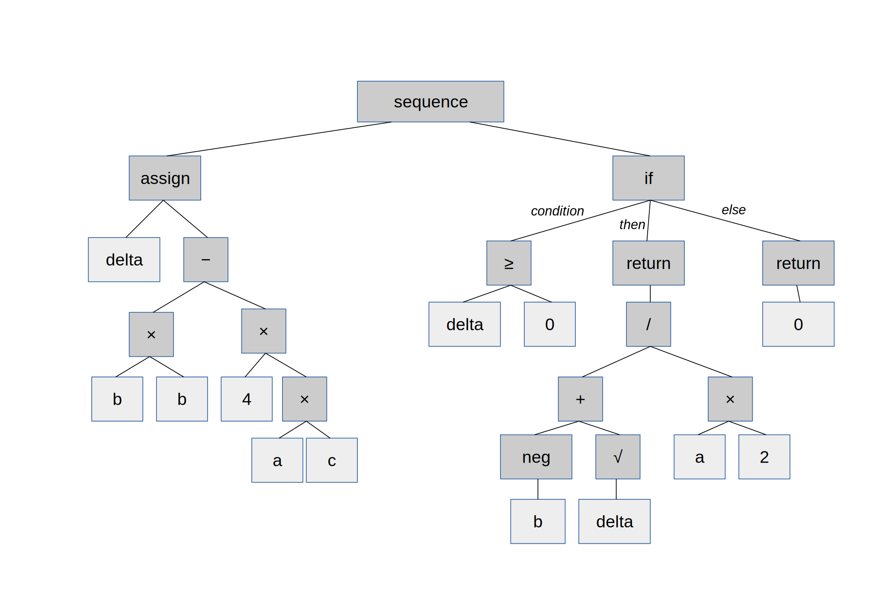

# Genetic Programming Experiments

Copyright (C) 2019 Filip Szczerek <ga.software@yahoo.com>

This project is licensed under the terms of the MIT license (see the `LICENSE` file for details).

----------------------------------------

- [Overview](#overview)
- [Genetic programming introduction](#genetic-programming-introduction)
- [Evolution](#evolution)
- [Experiments](#experiments)
  - [Seeker](#seeker)
- [Virtual machine and instruction set](#virtual-machine-and-instruction-set)
- [Building and running](#building-and-running)
- [Transcompilation of VM programs](#transcompilation-of-vm-programs)
- [References](#references)

----------------------------------------


# Overview

This repository chronicles my genetic programming experimentation attempts.
You may want to skip directly to the most interesting part: [Experiments](#experiments).


# Genetic programming introduction

Genetic programming aims to provide solutions to problems by direct evolution/breeding of computer programs. (Compare to less powerful _genetic algorithms_, where a program/algorithm is predefined and only its parameter vector undergoes evolution).

Of course, in order to be able to mutate or interbreed programs, an appropriate representation is needed. One cannot e.g. start randomly changing lines in a C source code, as the result would likely not be syntactically correct.

One of the forms of representation in genetic programming it the tree representation (hence TGP, _Tree-Based Genetic Programming_). For example, the following code in C:

```C
float solve_quadratic(float a, float b, float c)
{
    float delta = b*b - 4*a*c;
    if (delta >= 0.0)
        return (-b + sqrt(delta)) / (2*a);
    else
        return 0.0;
}
```

can be converted to the following syntax tree:



A tree like this can be mutated by changing individual nodes (provided that the new node has the same return type and the number & type of inputs), and also whole subtrees can be swapped between programs.

Another approach is _Linear Genetic Programming_, where the program is represented by a sequence of simple operations. This is the approach used in this project; programs are composed of assembly instructions executed by a virtual machine.

The example above is equivalent to the following program (see the [section below](#virtual-machine-and-the-instruction-set) for instruction set details):

```
//
// Expects that arguments are placed in: data[0] = a, data[1] = b, data[2] = c. Result will be sent to output 0.
//
seti 1
load       // reg_v := b
mul        // reg_v *= b
seti 3
store      // data[3] := b*b

seti 4     // reg_i := 4
itov       // reg_v := reg_i, reg_v == 4.0
seti 0
mul        // reg_v *= a
seti 2
mul        // reg_v *= c
seti 4
store      // data[4] := 4.0*a*c

seti 3
load       // reg_v := b*b
seti 4
sub        // reg_v -= 4.0*a*c, reg_v == delta

jumpifn    // if reg_v negative, jump to `endjump`
  sqrt     // reg_v := sqrt(delta)
  seti 1
  sub      // reg_v := sqrt(delta) - b
  seti 0
  div      // reg_v /= a
  seti 2
  itov
  div      // reg_v /= 2, reg_v == (-b + sqrt(delta)) / (2*a)
  output 0 // send result to output 0
endjump

seti 0
itov
output 0   // send 0.0 to output 0
```

Obviously, one can change individual instructions and swap whole blocks between programs – the result will still be a correct program.


# Evolution

An evolutionary search for solution requires defining a _fitness function_, which is used to rate the performance of programs. E.g. if we want a program to interpolate a set of data points, the fitness function could be the sum of absolute differences between actual and interpolated values (with lower result indicating better performance).

The process starts by creating a population of randomly-generated programs. In each evolution step, the fitness of each program is assessed and the best-performing ones are chosen for reproduction (the worst-performers are culled). As it turns out, simply copying the programs with mutations is much less effective (in improving fitness) than mutation **and** interbreeding, i.e. exchanging whole (possibly large) program fragments.

The selection procedure can be as simple as choosing the best-fitness fraction of programs from the whole population, to more involved schemes like _fitness tournaments_ and having multiple sub-populations evolving in parallel with periodic migration of the best individuals.

Though it might seem unlikely, the initial “primordial soup” of random, meaningless programs indeed starts to optimize for fitness under the constant evolutionary pressure. You can find examples in the section below.


# Experiments

## Seeker

Breed a program that controls an agent moving on a square grid. The program should be able to navigate between user-defined start and end points.

Go to the [experiment page](./src/bin/seeker/README.md).


# Virtual machine and instruction set

The instruction set is based on _Slash/A_ language by Artur B Adib. The virtual machine contains the index register `reg_i` (integer), the calculation register `reg_v` (floating-point), the instruction pointer, and a user-defined number of (floating-point) data slots `data[]`. Unary arithmetic instructions operate on `reg_v` (e.g. `Neg` performs `reg_v := -reg_v`), binary ones on `reg_v` and `data[reg_i]` (e.g. `Add` performs `reg_v += data[reg_i]`). Branching is realized by `IfP`, `IfN`, which execute the next instruction if `reg_v` is non-negative or negative, respectively; and by `JumpIfN` (which jumps forward to `EndJump` at the same nesting level if `reg_v` is negative) and `GoToIfP` (which jumps backward to `EndGoto` at the same nesting level if `reg_v` is non-negative).

Communication with the environment is possible using the `Input` and `Output` instructions. The user can specify callbacks executed for each `Input`/`Output`: `Input` callback receives the input number and returns input value; `Output` callback receives the output number and the output value).

A program can be optimized before running by removing ineffective sequences (e.g. a series of `SetI`, of which only the last takes effect). This, however, is for fitness evaluation only; the evolution operates on non-optimized versions.

See `src/vm.rs` (and the unit tests there) for details.


# Building and running

## Prerequisites

Install the Rust toolchain (https://www.rust-lang.org/tools/install).

## Building

Clone the repository and change to the project directory:

```
git clone https://github.com/GreatAttractor/genetic.git
cd genetic
```

To run the unit tests:

```
cargo test
```

See the [experiment pages](#experiments) for details on building and running them.


# Transcompilation of VM programs

In case a genetic program needs to be run at top speed, it could be easily transpiled, e.g.:

```
seti 4
load
seti 5
add
mul
store
```

to C code:

```C
double data[NUM_DATA_SLOTS];

//...

reg_i = 4;
reg_v = data[reg_i];
reg_i = 5;
reg_v += data[reg_i];
reg_v *= data[reg_i];
data[reg_i] = reg_v;
```

which should be then heavily optimized by C compiler.

At the moment, there is only the translation to JavaScript VM-with-embedded-program implemented (`transpile/javascript_vm.rs`) for simple integration as a runnable demo (see the [Seeker experiment](#seeker)).


# References

[1] Markus Brameier _On Linear Genetic Programming_. Dortmund 2004.
