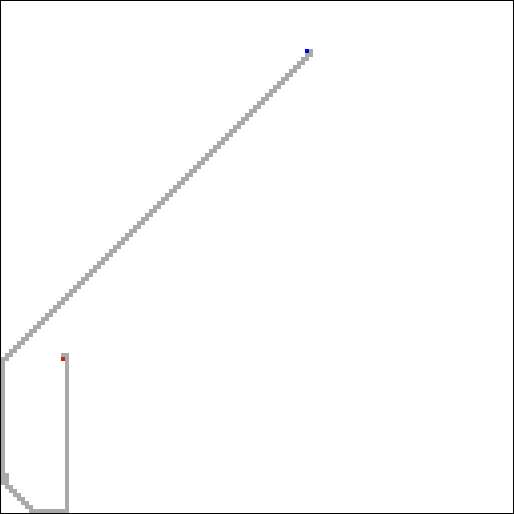
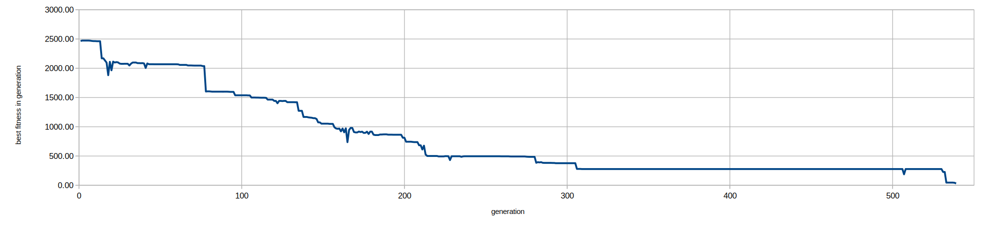
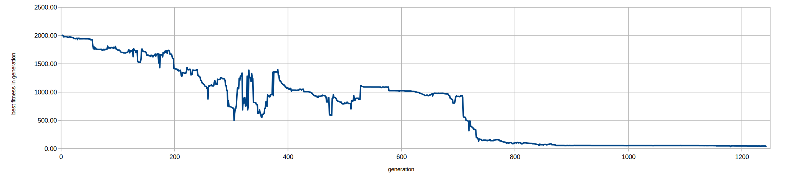
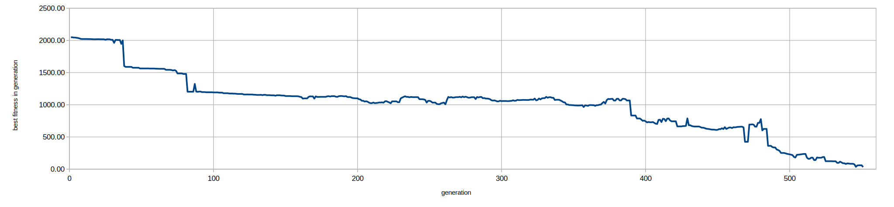
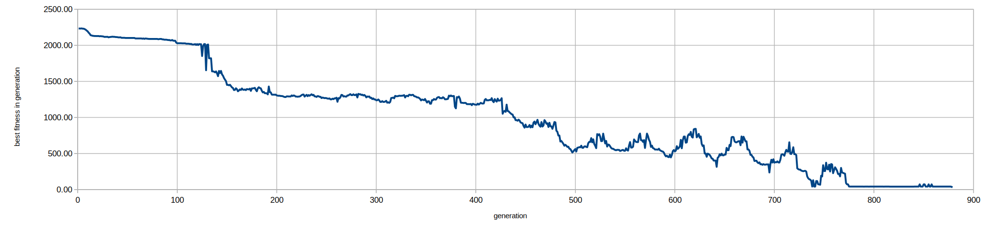

# Seeker

The goal is to obtain a program that controls an agent moving on a square grid, capable of navigating between user-specified start and end locations.



You can skip directly to the runnable demo of such a program:

  - [link 1](demo/demo.html) (if on a local clone)

  - [link 2](https://greatattractor.github.io/genetic/src/bin/seeker/demo/demo.html) (if reading this on GitHub)


## Fitness evaluation

Before evaluating a program (see `evaluate_fitness` in `src/bin/seeker/main.rs`), an `Agent` structure is initialized to the start location. The following input/output callbacks are set up:

| Instruction executed | Action            |
|----------------------|-------------------|
| input 0              | return `agent.x`  |
| input 1              | return `agent.y`  |
| input 2              | return `target.x` |
| input 3              | return `target.y` |
| output 0             | `agent.x += 1`    |
| output 1             | `agent.x -= 1`    |
| output 2             | `agent.y += 1`    |
| output 3             | `agent.y -= 1`    |

The program is then run in a loop until the agent reaches the target or the number of executed instructions exceeds the limit (set to `MAX_EXEC_INSTRUCTIONS = 5000` in the _Tunable experiment parameters_ section in `src/bin/seeker/main.rs`). The evaluation is performed for 32 fixed randomly generated test cases (i.e. start-end pairs), and the final fitness value is the sum of the final agent-target distances for each case. (Since at the moment programs are not judged by how much time or distance they take to get there, we may expect to see some rather convoluted paths.)

One might be afraid that the programs will evolve to only solve the test cases; however, it appears their number and randomization are enough to produce universal programs that work for any user-supplied start-end pair of points.


## Evolution

The experiment begins with 128 random programs of 16 to 32 instructions. In each step, 20% of the best-performing programs are chosen for reproduction, creating a new population (also of 128 programs). Blocks of 6-256 instructions can be swapped between programs during crossover; program length is limited to 1024 instructions.

If the best historical program fitness has not improved for 16 generations, _plateau mitigation_ is performed: for 30 generations the mutation probability and density are greatly increased. While it may temporarily worsen the current best fitness, this infusion of “fresh blood” helps to eventually reach a better optimum (see `evaluate_and_reproduce_best_programs` in `src/bin/seeker/main.rs`).

The graphs below illustrate how the fitness (of the best program in generation) evolves for a few different runs:





The oscillations in the last graph’s second half correspond to plateau mitigation; each rise is caused by the increased mutation rate, but in the end we end up with improved (lower) fitness.

## Building and running

To build and run the experiment, execute the following in the project directory:

```
cargo run --release --bin seeker
```

By default, all CPU cores are utilized. The number of worker threads can be changed with `RAYON_NUM_THREADS`, e.g.:

```
RAYON_NUM_THREADS=2 cargo run --release --bin seeker
```

`RND_SEED` at the beginning of `src/bin/seeker/main.rs` can be modified to change the initial population and test cases.

Sample output:

```
…
874: best fitness: 40.00 (so far: 40.00)
875: best fitness: 40.00 (so far: 40.00)
876: best fitness: 40.00 (so far: 40.00)
877: best fitness: 40.00 (so far: 40.00)
878: best fitness: 40.00 (so far: 40.00)
879: best fitness: 40.00 (so far: 40.00)
880: (p) best fitness: 40.00 (so far: 40.00)
881: (p) best fitness: 32.00 (so far: 32.00)

Saving the best program as:
  - program.vmasm (VM assembly)
  - src/bin/seeker/demo/program.js (JavaScript virtual machine)
```

`(p)` indicates that plateau mitigation is in progress.

Once a program to solve all test cases is found, it is saved to `program.vmasm` (VM assembly) and in a runnable form to `src/bin/seeker/demo/program.js` (as JavaScript, packaged in a VM). It can be tested by opening `src/bin/seeker/demo/demo.html` in a web browser.

There is also a [demo hosted on GitHub](https://greatattractor.github.io/genetic/src/bin/seeker/demo/demo.html).
